# Response Cache Architecture

## System Flow with Caching

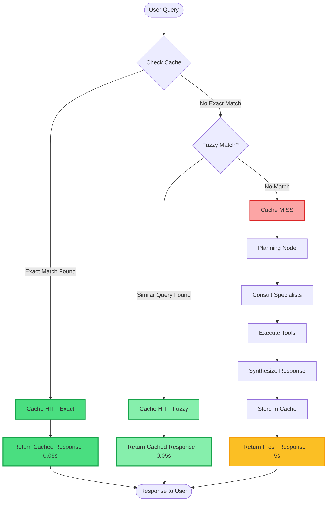

## Cache Matching Process

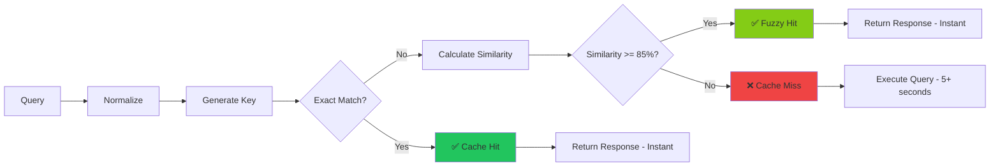

## Query Normalization

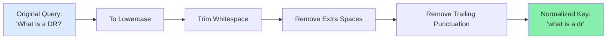

## Cache Storage Structure

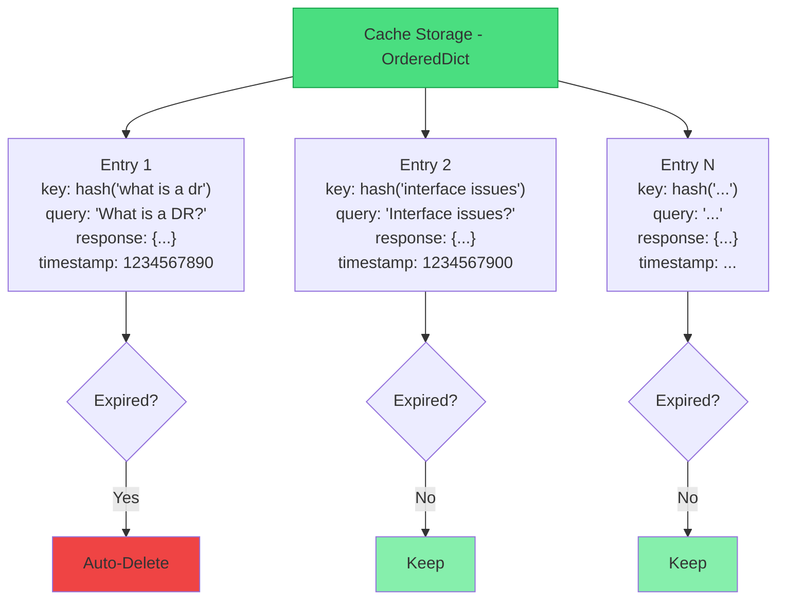

## Fuzzy Matching Algorithm

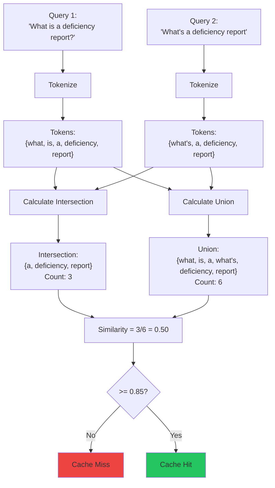

## Performance Comparison

### Without Cache
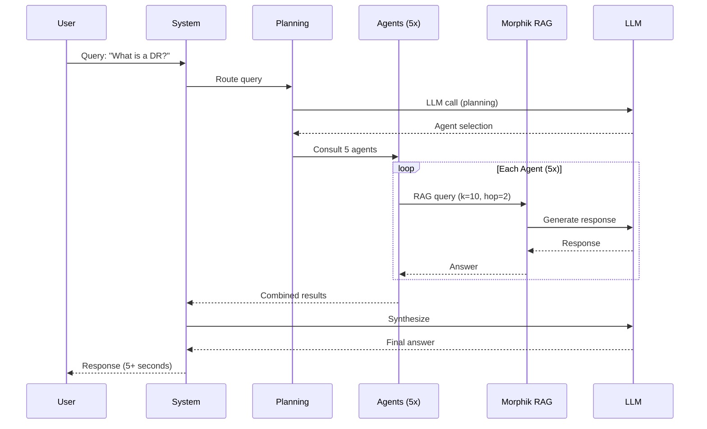

### With Cache (Hit)
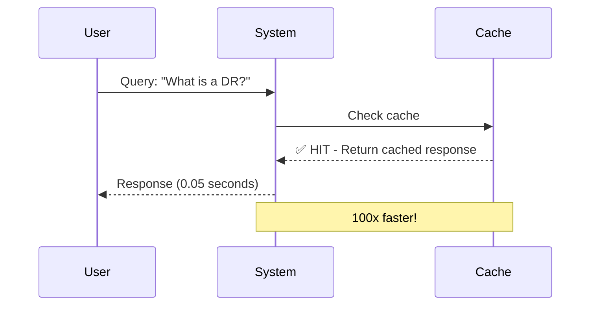

## Cache Lifecycle

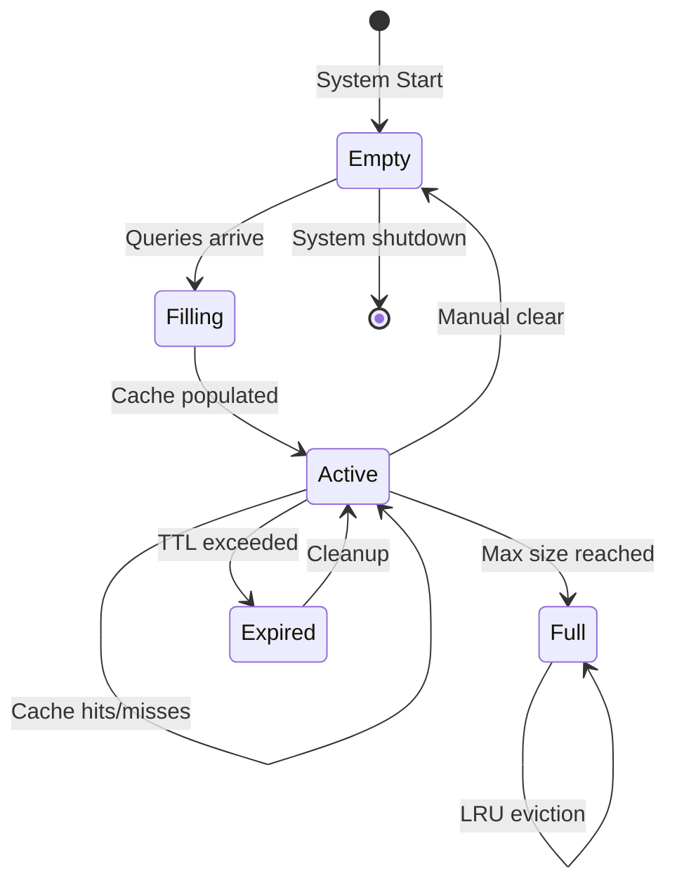

## Thread Safety

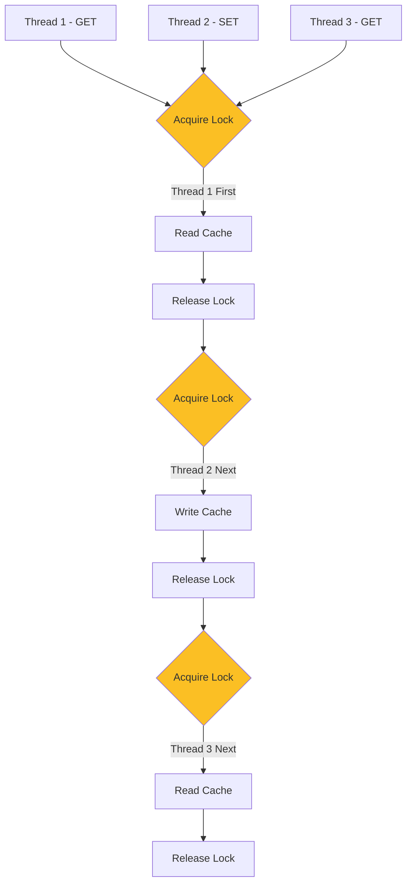

## Cache Hit Rate Over Time

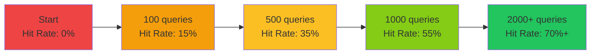

## Integration Points

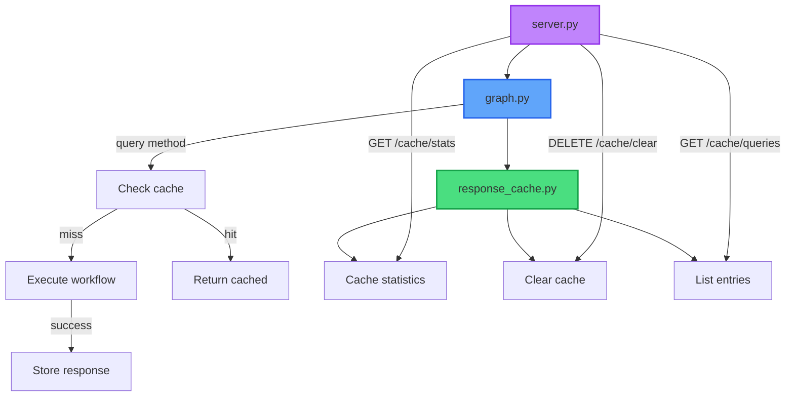

## Memory Usage

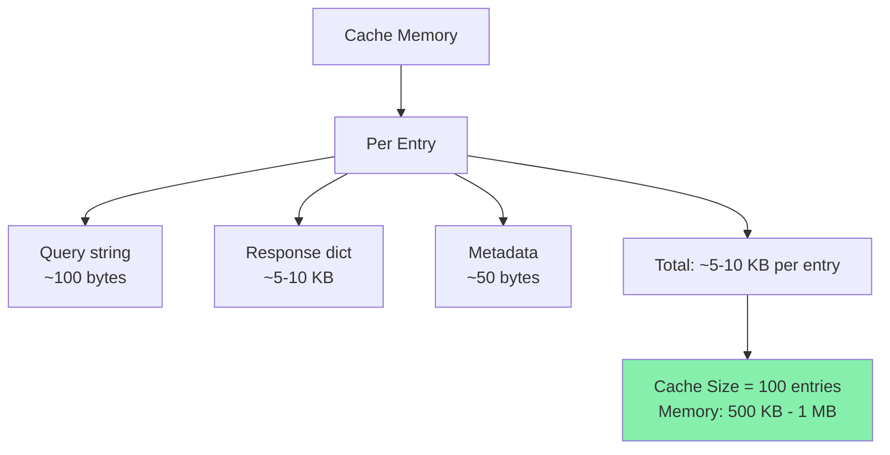

---

## Summary

The response cache provides:
- ✅ **100x speed improvement** for cached queries
- ✅ **Fuzzy matching** for similar queries
- ✅ **Automatic expiration** (TTL-based)
- ✅ **LRU eviction** when full
- ✅ **Thread-safe** operations
- ✅ **Low memory footprint** (~1MB for 100 entries)

Perfect for FAQ scenarios where users ask the same questions repeatedly!
