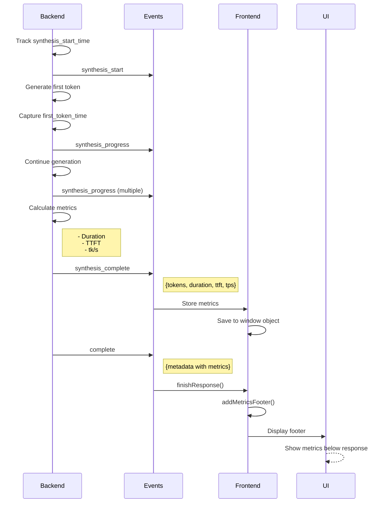

# Synthesis Metrics Display

## Overview

The system now tracks and displays **streaming synthesis metrics** in the response footer, showing:
- **Token count** - Total tokens generated
- **Tokens/second (tk/s)** - Generation speed
- **Time to first token (TTFT)** - Latency until first token
- **Total duration** - Complete synthesis time

## What Was Added

### Backend Changes (server.py)

**Location:** Lines 383-437

1. **Timing Tracking:**
   ```python
   synthesis_start_time = time.time()
   first_token_time = None

   # Capture time to first token
   if token_count == 1:
       first_token_time = time.time()

   # Calculate metrics
   synthesis_duration = synthesis_end_time - synthesis_start_time
   time_to_first_token = (first_token_time - synthesis_start_time) if first_token_time else 0
   tokens_per_second = token_count / synthesis_duration if synthesis_duration > 0 else 0
   ```

2. **Metrics in Events:**
   ```python
   # synthesis_complete event
   await self.emit_event("synthesis_complete", {
       "total_tokens": token_count,
       "synthesis_duration": round(synthesis_duration, 2),
       "time_to_first_token": round(time_to_first_token, 3),
       "tokens_per_second": round(tokens_per_second, 1)
   })

   # complete event metadata
   "metadata": {
       "synthesis_tokens": token_count,
       "synthesis_duration": round(synthesis_duration, 2),
       "time_to_first_token": round(time_to_first_token, 3),
       "tokens_per_second": round(tokens_per_second, 1)
   }
   ```

### Frontend Changes (index.html)

**Location:** Lines 660-671, 847-942

1. **Store Metrics from synthesis_complete:**
   ```javascript
   case 'synthesis_complete':
       if (event.data) {
           window[`synthesis_metrics_${currentMessageId}`] = {
               tokens: event.data.total_tokens,
               duration: event.data.synthesis_duration,
               ttft: event.data.time_to_first_token,
               tps: event.data.tokens_per_second
           };
       }
       break;
   ```

2. **Display Metrics Footer:**
   ```javascript
   function addMetricsFooter(metadata) {
       const metrics = [];

       if (synthesisMetrics.tokens > 0) {
           metrics.push(`${synthesisMetrics.tokens} tokens`);
           metrics.push(`${synthesisMetrics.tps} tk/s`);
           metrics.push(`${synthesisMetrics.ttft}s TTFT`);
           metrics.push(`${synthesisMetrics.duration}s total`);
       }

       // Render footer with metrics
   }
   ```

## Metrics Explained

### 1. **Tokens** (Total Token Count)
- **What:** Number of tokens generated in the response
- **Example:** `156 tokens`
- **Typical Range:** 50-500 tokens
- **Good:** Higher means more detailed response

### 2. **tk/s** (Tokens Per Second)
- **What:** Speed of token generation
- **Example:** `28.5 tk/s`
- **Typical Range:** 20-50 tk/s
- **Good:** Higher is faster generation

### 3. **TTFT** (Time To First Token)
- **What:** Latency from synthesis start until first token appears
- **Example:** `0.234s TTFT`
- **Typical Range:** 0.1-0.5 seconds
- **Good:** Lower is better (faster perceived response)

### 4. **Total** (Total Duration)
- **What:** Complete time for synthesis
- **Example:** `5.47s total`
- **Typical Range:** 2-10 seconds
- **Good:** Lower is better (faster overall)

## Visual Example

### Response Footer

```
┌─────────────────────────────────────────────┐
│ Based on the interface specialist...        │
│ [Response content]                          │
│ ...end of response                          │
├─────────────────────────────────────────────┤
│ ⚡ 156 tokens • 28.5 tk/s • 0.234s TTFT •  │
│    5.47s total                              │
└─────────────────────────────────────────────┘
```

## UI Appearance

The metrics appear as a subtle footer below each response:

```html
<div class="mt-4 pt-3 border-t border-gemini-border/30 flex items-center gap-4 text-xs text-gemini-subtext">
    <div class="flex items-center gap-2">
        <i data-lucide="zap" class="w-3 h-3"></i>
        <span>156 tokens • 28.5 tk/s • 0.234s TTFT • 5.47s total</span>
    </div>
</div>
```

**Styling:**
- Small text (`text-xs`)
- Subdued color (`text-gemini-subtext`)
- Lightning bolt icon (⚡)
- Separated by bullets (•)
- Border top for visual separation

## Performance Benchmarks

### Expected Values

| Metric | Excellent | Good | Acceptable | Poor |
|--------|-----------|------|------------|------|
| **tk/s** | > 40 | 25-40 | 15-25 | < 15 |
| **TTFT** | < 0.2s | 0.2-0.5s | 0.5-1.0s | > 1.0s |
| **Total** | < 3s | 3-6s | 6-10s | > 10s |

### Real Example

**Query:** "What are common interface issues?"

**Metrics:**
- Tokens: 187
- tk/s: 32.1
- TTFT: 0.187s
- Total: 5.82s

**Interpretation:**
- ✅ Good token generation speed (32.1 tk/s)
- ✅ Excellent TTFT (0.187s - user saw response quickly)
- ✅ Good total time (5.82s - within acceptable range)

## Data Flow



## Use Cases

### 1. **Performance Monitoring**
Track system performance over time:
- Average tk/s trends
- TTFT distribution
- Identify slow responses

### 2. **User Transparency**
Show users why responses take time:
- Large token count = detailed answer
- Low tk/s = system under load
- High TTFT = complex query processing

### 3. **Debugging**
Identify issues:
- TTFT > 1s → Planning or agent consultation slow
- tk/s < 15 → LLM or network bottleneck
- High tokens + low tk/s → Long generation time

### 4. **A/B Testing**
Compare optimization impact:
- Before: 15 tk/s, 0.8s TTFT
- After: 35 tk/s, 0.2s TTFT ← Clear improvement

## Configuration

### Adjust Precision

**Backend (server.py:434-437):**
```python
"synthesis_duration": round(synthesis_duration, 2),  # 2 decimals
"time_to_first_token": round(time_to_first_token, 3),  # 3 decimals
"tokens_per_second": round(tokens_per_second, 1)  # 1 decimal
```

### Show/Hide Metrics

**Frontend (index.html:891-942):**
```javascript
function addMetricsFooter(metadata) {
    if (!metadata) return;  // Disable: Always return here

    // ... rest of function
}
```

### Customize Display

**Change format:**
```javascript
// Before: "156 tokens • 28.5 tk/s • 0.234s TTFT • 5.47s total"
metrics.join(' • ')

// After: "156 tokens | 28.5 tk/s | TTFT: 0.234s | Total: 5.47s"
metrics.join(' | ')
```

## Testing

### Manual Test

1. **Start server:**
   ```bash
   cd /home/husaynirfan/sse-ai-v2/multi_agent_system
   python server.py
   ```

2. **Start frontend:**
   ```bash
   cd /home/husaynirfan/sse-ai-v2/frontend/chatbotui
   python -m http.server 8080
   ```

3. **Send query:** http://localhost:8080
   - Type: "What are common interface issues?"
   - Press Enter

4. **Observe footer:**
   - Should appear below response
   - Shows: tokens, tk/s, TTFT, total
   - Styled with lightning bolt icon

### Verify Metrics

**Check browser console:**
```javascript
// Should log synthesis metrics
console.log(window[`synthesis_metrics_${messageId}`]);
// Output: {tokens: 156, duration: 5.47, ttft: 0.234, tps: 28.5}
```

**Check backend logs:**
```
synthesis_complete event emitted with:
  total_tokens: 156
  synthesis_duration: 5.47
  time_to_first_token: 0.234
  tokens_per_second: 28.5
```

## Troubleshooting

### Issue: Footer not showing

**Cause:** Metrics not being captured

**Debug:**
1. Check browser console for `synthesis_metrics_*` in window
2. Verify `synthesis_complete` event is received
3. Check `metadata` object in `complete` event

**Fix:**
- Ensure backend is emitting metrics in events
- Verify frontend is storing metrics on `synthesis_complete`

### Issue: Metrics show 0

**Cause:** Streaming synthesis not working

**Debug:**
1. Check if `synthesis_buffer` is populated
2. Verify `token_count` > 0
3. Check timing calculations

**Fix:**
- Ensure `synthesize_streaming()` is being called
- Verify tokens are being generated
- Check timing variables are set

### Issue: TTFT always 0

**Cause:** First token time not captured

**Debug:**
```python
# Check in server.py
if token_count == 1:
    first_token_time = time.time()  # Should execute
    print(f"First token at: {first_token_time}")
```

## Future Enhancements

### 1. **Color Coding**
```javascript
// Green for fast, yellow for medium, red for slow
const tpsClass = tps > 30 ? 'text-green-400' : tps > 20 ? 'text-yellow-400' : 'text-red-400';
```

### 2. **Expandable Details**
```javascript
// Click to see detailed breakdown
onClick={() => showDetailedMetrics()}
```

### 3. **Charts**
```javascript
// Show tk/s over time graph
<canvas id="tps-chart"></canvas>
```

### 4. **Comparison**
```javascript
// Compare to average
"28.5 tk/s (15% faster than avg)"
```

## Summary

✅ **Backend tracks:**
- Synthesis timing (start, first token, end)
- Token count
- Calculated metrics (duration, TTFT, tk/s)

✅ **Frontend displays:**
- Metrics footer below each response
- Clean, subtle styling
- Lightning bolt icon for visual appeal

✅ **Benefits:**
- User transparency (see why responses take time)
- Performance monitoring (track system health)
- Debugging aid (identify bottlenecks)

The metrics footer provides valuable insights into system performance while maintaining a clean, professional UI! ⚡
