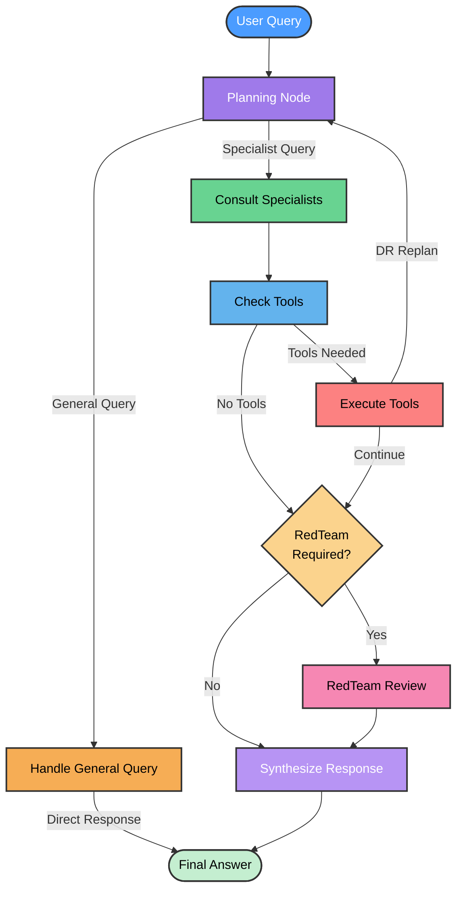

# LangGraph Multi-Agent System Architecture

## System Flow Diagram



## Detailed Node Descriptions

### 1. **Planning Node** 🎯
- **Purpose**: Analyzes query and determines routing strategy
- **Outputs**:
  - `query_type`: "general" or "specialist"
  - `agents_to_consult`: List of specialist agents
  - `num_specialists_to_consult`: Exact count
  - `is_general_query`: Boolean flag
  - `require_redteam`: Security review flag

### 2. **Handle General Query** 💬
- **Purpose**: Processes simple queries without specialist consultation
- **Examples**: Greetings, FAQs, "What can you do?"
- **Flow**: Direct to END (bypasses all other nodes)
- **Agent**: GeneralAgent (uses base LLM)

### 3. **Consult Specialists** 👥
- **Purpose**: Queries domain expert agents in parallel
- **Available Specialists**:
  - Interface Specialist (UI/HMI)
  - Motion Specialist
  - Vibration Specialist
  - Visual Specialist
  - Computer Specialist
- **Limits**: Consults only `num_specialists_to_consult` agents

### 4. **Check Tools** 🔧
- **Purpose**: Determines if additional tools are needed
- **Available Tools**:
  - `search_deficiency_records` (DR search)
  - `search_inventory` (Parts/stock)
  - `create_diagram` (Mermaid visualization)
  - `fill_overtime_form` (OT form generation)
- **Special Handling**:
  - OT form requests: Multi-turn conversation
  - DR replan: Loops back to planning with context

### 5. **Execute Tools** ⚙️
- **Purpose**: Runs selected tools and processes results
- **DR Feedback Loop**:
  - If DR results found + other specialists planned → Replan
  - Adds DR context to query and loops back to Planning
- **Tracking**: Maintains `tools_called` list to prevent duplicates

### 6. **RedTeam Review** 🛡️
- **Purpose**: Security analysis for sensitive queries
- **Triggers**: Keywords like "security", "vulnerability", "attack"
- **Agent**: RedTeamAgent

### 7. **Synthesize Response** 🎨
- **Purpose**: Combines all specialist and tool outputs
- **Process**:
  - Filters relevant responses
  - Resolves conflicts
  - Creates unified markdown response
- **Special Formatting**: Tables, code blocks, DR details

## Conditional Routing Logic

### General vs Specialist Detection
```python
if no agents_to_consult and not OT form request:
    → General Query → Handle General → END
else:
    → Specialist Query → Consult Specialists → ...
```

### Tool Execution Decision
```python
if LLM decides tools needed and not already called:
    → Execute Tools
else:
    → Skip to RedTeam check
```

### DR Replan Loop
```python
if DR results found and other specialists planned and not already replanned:
    → Add DR context to query
    → Loop back to Planning
    → Re-consult specialists with DR knowledge
else:
    → Continue to RedTeam
```

### RedTeam Routing
```python
if require_redteam flag set:
    → RedTeam Review → Synthesize
else:
    → Skip to Synthesize
```

## State Management

### AgentState Fields
- `query`: Current user query (may be enriched with DR context)
- `messages`: LangChain message history
- `agents_to_consult`: List of specialists to query
- `num_specialists_to_consult`: Exact count to limit consultation
- `agent_responses`: Accumulated specialist responses
- `tool_responses`: Accumulated tool outputs
- `tools_called`: List of already-executed tools
- `final_answer`: Synthesized response
- `current_step`: Workflow position tracker
- `require_redteam`: Boolean for security review
- `dr_replan_triggered`: Boolean for DR loop control
- `dr_replan_done`: Boolean to prevent infinite loops
- `ot_conversation_state`: OT form multi-turn state
- `ot_conversation_active`: OT conversation flag
- `is_general_query`: General query flag

## Agent Roster

### Specialist Agents (Morphik-backed)
1. **Interface Specialist** - UI/HMI/Controls
2. **Motion Specialist** - Actuators/Kinematics
3. **Vibration Specialist** - Frequency/Damping
4. **Visual Specialist** - Projectors/Graphics
5. **Computer Specialist** - Hardware/Software/Network
6. **RedTeam Agent** - Security Analysis
7. **DR Agent** - Deficiency Records (tool-based)
8. **Inventory Agent** - Parts/Stock (tool-based)

### Utility Agents
9. **General Agent** - Simple queries (LLM-only)
10. **Planning Agent** - Routing/Orchestration (LLM-only)

## Key Features

✅ **Intelligent Routing**: Detects general vs specialist queries  
✅ **DR Feedback Loop**: Re-plans with deficiency record context  
✅ **Tool Deduplication**: Prevents redundant tool calls  
✅ **Parallel Execution**: Specialists queried concurrently  
✅ **Multi-turn Conversations**: OT form data collection  
✅ **Security Review**: Optional RedTeam analysis  
✅ **Fast General Responses**: Bypasses entire workflow for simple queries
